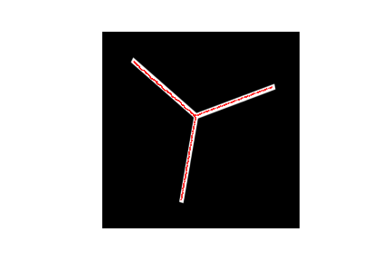

# pydmtgraph

A Python extension for extracting a graph from a grayscale image.



This is an implementation of the algorithm from the paper ["Graph Reconstruction by Discrete Morse Theory"](https://arxiv.org/abs/1803.05093) by Dey, Wang, and Wang.
Our implementation is optimized for 2d images.

### Dependencies

```
Boost
```

### Installing

To build the model, change directory to ```src``` and run
```
pip install .
```
The ```pydmtgraph``` module can then be included in Python files with the command
```
import pydmtgraph
```

### Uninstalling

To install, run the command
```
pip uninstall pydmtgraph
```
